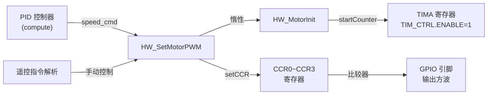

# hw_adapter 模块详解 —— 当你看代码旁边的注释都看不懂时来翻阅的百科全书

> **硬件适配层** —— 整个嵌入式项目中**唯一**与 MSPM0G3507 寄存器/外设打交道的文件。
> 上层算法（PID、循迹、滤波）**完全不知道**硬件存在，它们只调用 `HW_SetMotorPWM(-1000, 800)` 这种纯逻辑接口。
> 这就是"硬件抽象层"的核心思想：**把芯片厂家的 DriverLib API 包一层，让上层算法只看到业务语义**。

---

## 目录

1. [文件结构概览](#1-文件结构概览)
2. [前置知识：MSPM0G3507 与 DriverLib 速通](#2-前置知识mspm0g3507-与-driverlib-速通)
3. [头文件 hw_adapter.h 详解](#3-头文件-hw_adapterh-详解)
4. [源文件 hw_adapter.c 逐段详解](#4-源文件-hw_adapterc-逐段详解)
   - [4.1 包含头文件与宏定义](#41-包含头文件与宏定义)
   - [4.2 模块初始化状态标志 static 变量](#42-模块初始化状态标志-static-变量)
   - [4.3 系统定时器：HW_GetTick / HW_TickInc / HW_DelayMs](#43-系统定时器hw_gettick--hw_tickinc--hw_delayms)
   - [4.4 电机 PWM：HW_MotorInit / HW_SetMotorPWM](#44-电机-pwmhw_motorinit--hw_setmotorpwm)
   - [4.5 编码器 QEI：HW_EncoderInit / HW_GetEncoderCnt / HW_ClearEncoderCnt](#45-编码器-qeihw_encoderinit--hw_getencodercnt--hw_clearencodercnt)
   - [4.6 灰度传感器 ADC：HW_LineSensorInit / HW_ReadLineSensors](#46-灰度传感器-adchw_linesensorinit--hw_readlinesensors)
   - [4.7 IMU（I2C）：HW_IMUInit / HW_ReadGyroDPS / HW_ReadAccelG](#47-imu-i2chw_imuinit--hw_readgyrodps--hw_readaccelg)
5. [模块解耦总图（调用链）](#5-模块解耦总图调用链)
6. [常见问题与排查指南](#6-常见问题与排查指南)

---

## 1. 文件结构概览

```
hw_adapter.h      —— 头文件，对外暴露15个函数声明 + 4个常量宏
hw_adapter.c      —— 实现文件，~210行，纯C，零第三方依赖（除了 TI DriverLib）
```

**设计哲学：**
- 每一个外设（PWM / QEI / ADC / I2C）的初始化函数都返回 `uint8_t`，`0` 表示成功，`1` 表示失败（但目前实现都是 `return HW_OK`，没有错误检测——因为 MSPM0 不像 Linux 驱动那样有 probe 失败机制，外设没配就是编译时决定的）。
- 每一个外设都有对应的"已初始化标志"（`motor_inited` 等），防止二次初始化。
- 通过 `#if defined(X_INST)` 实现**编译期桩函数**：如果 SysConfig 没配这个外设，相关代码整个被预处理器吃掉，函数退化为空操作。

---

## 2. 前置知识：MSPM0G3507 与 DriverLib 速通

如果你完全没碰过 MSPM0，先花30秒理解下面几个概念：

| 术语 | 解释 |
|------|------|
| **SysConfig** | TI 的图形化外设配置工具。你在 GUI 里勾选 PWM、ADC 等，它自动生成 `ti_msp_dl_config.h` 和 `ti_msp_dl_config.c`。宏如 `PWM_0_INST`、`ADC_0_INST` 都是它定义的。 |
| **DriverLib (DL_)** | TI 提供的寄存器操作封装库。例如 `DL_TimerA_startCounter` 在底层就是写 TIMx->CTRL 寄存器的某些位。你不用直接查数千页的 Reference Manual。 |
| **TIMG / TIMA** | MSPM0 的定时器类型。TIMA（高级定时器）带互补PWM、死区插入，适合电机控制。TIMG（通用定时器）功能较少，适合编码器/QEI。 |
| **QEI** | 正交编码器接口（Quadrature Encoder Interface）。MSPM0 的 TIMG 可以配置为 QEI 模式，自动解码 A/B 相脉冲并累加计数值。 |
| **ADC12** | 12位逐次逼近型 ADC。`DL_ADC12_getMemResult` 返回 0-4095 的数字量。 |
| **I2C** | 与 MPU6050 等外设通信的总线。MSPM0 作为主机。 |

> ⚠️ **重要：** MSPM0G3507 是 Cortex-M0+ 内核，**没有**硬件除法器，**没有**硬件浮点单元（FPU）。所有 float 运算由编译器用软件库模拟，速度较慢。

---

## 3. 头文件 hw_adapter.h 详解

### 第1行：文件注释

```c
//硬件抽象层,封装MCU外设驱动接口,适配MSPM0G3507
```

这行注释说明了这个文件的定位。注意用的是 `//` 而不是 `/* */` 风格——虽然不重要，但保持代码风格一致就好。

### 第2-3行：Include Guard（包含守卫）

```c
#ifndef HW_ADAPTER_H
#define HW_ADAPTER_H
```

**为什么需要 `#ifndef` ？**
C 语言的头文件可能被多个 `.c` 文件间接包含（比如 `hw_adapter.c` 包含一次，`main.c` 包含一次），如果没有守卫，编译器会看到同一个类型/函数声明两次，报"重复定义"错误。

### 第5-6行：标准整数类型

```c
#include <stdint.h>
#include <stdbool.h>
```

- `<stdint.h>`：定义了 `uint8_t`、`int16_t`、`uint32_t` 等定长整数类型。
  为什么不用 `int`？因为 `int` 在不同平台长度不同（32位机上4字节，8位机上2字节），而定长类型保证跨编译器一致。
- `<stdbool.h>`：定义了 `bool`、`true`、`false`。不过在本头文件中并没有使用 `bool`，仅仅是习惯性包含。

### 第8-10行：C++ 兼容

```c
#ifdef __cplusplus
extern "C" {
#endif
```

**为什么需要？**
这个项目的文件名是 `empty_cpp_*`，说明这是一个 C++ 项目。C++ 编译器会对函数名进行 name mangling（名字修饰），而 TI DriverLib 和这段代码是用 C 写的。`extern "C"` 告诉 C++ 编译器：花括号内的函数声明使用 C 的链接规范，这样链接器才能正确找到 `.c` 文件中定义的符号。

### 第12-13行：通用错误码

```c
#define HW_OK                   0
#define HW_ERR                  1
```

极简的错误码体系。`0` 表示成功是 C 语言的惯例（很多系统调用如 `malloc` 也返回 0 表示失败——但这里约定 0 为成功，注意不要混淆）。`HW_ERR` 目前在任何函数中都没有被返回（所有函数都是 `return HW_OK`），这是预留接口。
> ⚠️ **踩坑**：`malloc` 返回 NULL(0) 表示失败，而这里 `HW_OK` 定义为 0 表示成功。两种不同的 0 含义。写代码时别搞混。

### 第15-16行：电机通道号

```c
#define HW_MOTOR_CH_LEFT        0
#define HW_MOTOR_CH_RIGHT       1
```

提高代码可读性。如果在算法代码中看到 `HW_SetMotorPWM(200, -150)`，你很难记住哪个是左哪个是右。但写成 `HW_SetMotorPWM(speed_left, speed_right)` 配合宏，自文档化。

### 第18-19行：编码器通道号

```c
#define HW_ENCODER_CH_LEFT      0
#define HW_ENCODER_CH_RIGHT     1
```

同上。注意编码器通道号和电机通道号是独立的宏——虽然数值相同，但语义不同，不能混用。

### 第21行：线阵传感器数量

```c
#define HW_LINE_SENSOR_COUNT    4
```

硬件上决定只有4路灰度传感器。如果改了硬件（比如用8路），只需要改这一个宏，`HW_ReadLineSensors` 中的循环次数自动适配。

### 函数声明详解

```c
uint32_t HW_GetTick(void);
void     HW_TickInc(void);
void     HW_DelayMs(uint32_t ms);
```

**这三个函数构成了系统的时间基准。**
- `HW_GetTick`：返回从开机到现在的毫秒数。**被谁调用**：`HW_DelayMs` 内部调用；上层算法中的延时、超时判断（如等待电机堵转超时）也会调用。
- `HW_TickInc`：被 SysTick 中断（每1ms一次）调用，将 `tick_ms` 加一。这个函数**只能**在中断上下文中调用。**被谁调用**：中断服务函数 `SysTick_Handler`。
- `HW_DelayMs`：阻塞式延时，参数为毫秒数。**为什么是阻塞的？** 简单可靠，适合初始化阶段。但如果在主循环中调用 `HW_DelayMs(1000)`，整个系统会停1秒——不能响应传感器、不能更新PID。所以主循环中应使用非阻塞方式（基于状态机的 `HW_GetTick` 差值判断）。

```c
uint8_t  HW_MotorInit(void);
void     HW_SetMotorPWM(int16_t left, int16_t right);
```

**电机控制接口。**
- `HW_MotorInit`：初始化 PWM 定时器。**被谁调用**：`HW_SetMotorPWM` 内部自动调用（惰性初始化）；也可在 `main` 中显式调用。
- `HW_SetMotorPWM`：设置左右轮 PWM。`left` 和 `right` 的取值范围是 `-1000 ~ 1000`。正数表示前进，负数表示后退，0 表示停止。**注意不是占空比百分比**，而是相对于定时器 period 的计数值，1000 对应 100% 占空比。**被谁调用**：PID 控制器的输出函数、遥控指令解析函数。

```c
uint8_t  HW_EncoderInit(void);
int32_t  HW_GetEncoderCnt(uint8_t ch);
void     HW_ClearEncoderCnt(uint8_t ch);
```

**编码器接口。**
- `HW_EncoderInit`：初始化 QEI 定时器。**被谁调用**：`HW_GetEncoderCnt` 内部自动调用。
- `HW_GetEncoderCnt`：读取当前编码器脉冲计数值。**被谁调用**：PID 的速度测量环节（通过单位时间内的脉冲增量计算速度）。
- `HW_ClearEncoderCnt`：清零计数值。**被谁调用**：每轮速度测量结束后、或电机方向切换时清零。
- `int32_t` 返回值：编码器是个**有符号**计数器。正转增加，反转减少。所以用 `int32_t`。

```c
uint8_t  HW_LineSensorInit(void);
void     HW_ReadLineSensors(uint16_t *buf);
```

**灰度（线阵）传感器接口。**
- `HW_LineSensorInit`：启动 ADC。**被谁调用**：`HW_ReadLineSensors` 内部自动调用。
- `HW_ReadLineSensors`：读取4路灰度值写入 `buf` 指向的数组。`uint16_t` 对于 12-bit ADC 来说够用（最大值 4095）。**被谁调用**：循迹算法中的传感器采样函数。

```c
uint8_t  HW_IMUInit(void);
uint8_t  HW_ReadGyroDPS(float *out_x, float *out_y, float *out_z);
uint8_t  HW_ReadAccelG(float *out_x, float *out_y, float *out_z);
```

**IMU 接口 — 目前是空壳。**
- `HW_IMUInit`：初始化 I2C 并配置 MPU6050 寄存器。**被谁调用**：`HW_ReadGyroDPS` 和 `HW_ReadAccelG` 内部自动调用。
- `HW_ReadGyroDPS`：读取角速度，单位 °/s（degrees per second）。
- `HW_ReadAccelG`：读取加速度，单位 g（重力加速度）。
- 目前这两个读函数都返回 `0.0f`——因为 I2C 驱动还没写好。
- `float *` 输出参数，不用返回值。**为什么用指针输出？**
  一种风格是把数据放进结构体返回（如 `typedef struct { float x, y, z; } GyroData_t;`），但这里用了逐个指针的方式。好处是调用方可以只读自己关心的轴：`HW_ReadGyroDPS(&gx, NULL, NULL);`。

---

## 4. 源文件 hw_adapter.c 逐段详解

### 4.1 包含头文件与宏定义

```c
#include "hw_adapter.h"
#include <stddef.h>
#include "ti_msp_dl_config.h"
```

**第6行 `#include "hw_adapter.h"`**：包含自己的头文件。C 语言的惯例：`.c` 文件的第一行包含对应的 `.h`。这一方面是为了编译器检查头文件中的声明和实现是否一致，另一方面 `.h` 中的宏定义（如 `HW_MOTOR_CH_LEFT`）对 `.c` 也可见。

**第7行 `#include <stddef.h>`**：定义 `NULL`。虽然 `hw_adapter.h` 包含的 `<stdint.h>` 可能间接包含了它，但显式包含是严谨的做法。`HW_ReadLineSensors` 中用到了 `if (buf == NULL) return;`。

**第8行 `#include "ti_msp_dl_config.h"`**：**这是 SysConfig 生成的关键头文件。**
它定义了所有外设的实例宏：
- `PWM_0_INST`：展开为 PWM 定时器的基地址（如 `(TIMER_A0_BASE)`）
- `QEI_0_INST`、`QEI_1_INST`：展开为定时器基地址
- `ADC_0_INST`：展开为 ADC 基地址
- `I2C_0_INST`：展开为 I2C 基地址

> ⚠️ **核心踩坑：** `PWM_0_INST` 是一个**地址常量**（如 `(TIMER_A0_BASE)`），它的类型是 `uint32_t`（指针）。**TI Clang 4.0.4 的预处理器不支持指针类型转换**，所以不能用 `#if PWM_0_INST != NULL` 或 `#if PWM_0_INST != 0` 这种写法——预处理器根本不理解指针类型，会直接报 `error: token is not a valid binary operator in a preprocessor subexpression`。
> 所以必须用 `#if defined(PWM_0_INST)` —— 这只检查宏**是否被定义**，不关心它的值是什么。

### 第10-11行：PWM 通道映射

```c
#define HW_PWM_CH_LEFT      DL_TIMER_CC_0_INDEX
#define HW_PWM_CH_RIGHT     DL_TIMER_CC_1_INDEX
```

这两个宏将"左轮"和"右轮"的概念映射到定时器的捕获比较通道索引。
- `DL_TIMER_CC_0_INDEX` 值为 0，对应定时器的 CC0 通道（引脚 PA10）
- `DL_TIMER_CC_1_INDEX` 值为 1，对应定时器的 CC1 通道（引脚 PA11）

为什么不在 `hw_adapter.h` 中定义？因为这些宏是**实现细节**，上层算法不需要知道 PWM 用的是哪个 CC 通道。隐藏实现细节是抽象层的基本要求。

### 4.2 模块初始化状态标志 static 变量

```c
static uint8_t motor_inited   = 0;
static uint8_t encoder_inited = 0;
static uint8_t line_inited    = 0;
static uint8_t imu_inited     = 0;
```

**为什么要 `static`？**
`static` 关键字在文件作用域中表示**内部链接（internal linkage）**——这些变量只在当前 `.c` 文件中可见，其他文件无法访问。这是 C 语言实现"私有成员"的方式（在 C++ 中会用 `private:`）。

**为什么用 `uint8_t` 而不是 `bool`？**
MSPM0 是 8/16/32 位混合架构，`uint8_t` 在内存中占用1字节，而 `bool` 在 C 语言中也是一个字节，没有区别。不过 `uint8_t` 可以扩展为更多状态（如 `0=未初始化`、`1=初始化成功`、`2=初始化失败`——虽然目前没用到）。

**为什么需要有这些变量？**
防止外设被重复初始化：
- 如果 `main` 中调用了 `HW_MotorInit()`，而后 PID 模块初始化时又调了一次，第一次的配置（如定时器分频系数）可能被覆盖。
- 不过目前这些变量的作用是**惰性初始化**（lazy initialization）——算法模块可能在任何时候调用硬件函数，而这些函数会在必要时自动初始化外设。如果已经初始化过了，直接跳过。

```c
static volatile uint32_t tick_ms = 0;
```

**这是整个文件中最关键的变量之一。**
- `volatile` 关键字：告诉编译器，这个变量可能被**编译器无法预知的方式**修改。在这里，`HW_TickInc` 在 SysTick 中断中修改 `tick_ms`，而 `HW_GetTick` 在主循环中读取。如果没有 `volatile`，编译器可能优化掉 `HW_GetTick()` 的读取——因为它认为 `tick_ms` 在两次读取之间没有被修改过，直接使用寄存器中的缓存值。这样你就永远得不到递增后的值了。

> ⚠️ **踩坑：** 如果忘记 `volatile`，`HW_DelayMs` 将变成**死循环**——因为 `(HW_GetTick() - start) < ms` 中的 `HW_GetTick()` 永远返回相同的值（寄存器缓存），条件永远为真。

> **volatile 到底干了什么？**
> 它告诉编译器三件事：
> 1. 每次读取该变量都必须从内存地址读取，不能使用寄存器副本
> 2. 每次写入都必须立即写入内存，不能延迟到寄存器
> 3. 对这个变量的操作不能因为"看起来没用到"而被优化掉
> 代价是：每次访问比普通变量慢几十纳秒（但对毫秒级的 tick 来说无所谓）。

### 4.3 系统定时器：HW_GetTick / HW_TickInc / HW_DelayMs

#### 4.3.1 HW_GetTick

```c
uint32_t HW_GetTick(void)
{
    return tick_ms;
}
```

**这是整个系统中绝大部分延时的基石。**

- 返回的是**开机到现在的毫秒数**。
- 返回值 `uint32_t`，最大计数值为 4,294,967,295 ms，约 **49.7 天**后溢出。49 天后 `tick_ms` 会从 `0xFFFFFFFF` 回到 `0`。
  > 但在 `HW_DelayMs` 中，`(HW_GetTick() - start)` 使用**无符号整数回绕特性**：即使 `tick_ms` 溢出，只要 `ms` 不太大（小于 49 天），减法结果仍然是正确的。
  > 例如：`start = 0xFFFFFF00`，tick 溢出后变成 `0x00000100`，差值 = `0x00000100 - 0xFFFFFF00 = 0x00000200`（512 ms），完全正确。
  > **前提：** `ms` 不能超过 `UINT32_MAX / 2`，否则可能因为回绕导致判断出错。

- **被谁调用：**
  - 内部：`HW_DelayMs` 第42行。
  - 上层：PID 周期计时、超时检测等。

#### 4.3.2 HW_TickInc

```c
void HW_TickInc(void)
{
    tick_ms++;
}
```

**这是从"中断上下文"到"主循环上下文"的数据传递。**

- 这个函数**必须**在 SysTick 中断中每 1ms 调用一次。
- 在 `main.c` 的 `SysTick_Handler`（或 `SysTick_IRQHandler`）中：
  ```c
  void SysTick_Handler(void) {
      HW_TickInc();
  }
  ```
- **为什么不在函数内加 `volatile`？** 变量声明处加了 `volatile`，所有对该变量的访问都会被正确处理，不需要在函数声明上额外标注。
- **为什么是 `tick_ms++` 而不是 `tick_ms += 1`？** 编译器会生成完全相同的机器码（Cortex-M0+ 的 `ADD` 指令），没有区别。
- ⚠️ **踩坑：** 这个函数**一次都不能多调**，也**一次都不能少调**。多调了系统时间变快，少调了系统时间变慢。如果 SysTick 配置的不是 1ms（比如配成了 10ms），那么整个延时系统都会按比例偏移。

#### 4.3.3 HW_DelayMs

```c
void HW_DelayMs(uint32_t ms)
{
    uint32_t start = HW_GetTick();
    while ((HW_GetTick() - start) < ms) { }
}
```

**最简单的阻塞式延时。**

- `start` 记录进入函数时的 tick 值。
- 循环条件不断检查当前 tick 与 start 的差值是否达到 `ms`。
- `HW_GetTick()` 每次循环都被调用（因为是 `volatile`，不会被优化为只读一次）。
- **为什么是空循环？** 这叫做"忙等待（busy-waiting/busy-loop）"。CPU 100% 占用，不干任何有用的事。
- **缺点：** 如果在 ISR 中调用 `HW_DelayMs(1000)`，整个中断会挂起 1 秒，系统完全停止响应其他中断。**绝不要在中断中调用！**
- **被谁调用：** 仅在**初始化阶段**使用。例如：等待 MPU6050 上电稳定（通常需要 100ms），或者等待电机驱动器使能后的稳定时间。

> **为什么不使用定时器硬件来做精确延时？**
> 用 SysTick + 全局 tick 的方式已经满足了"毫秒级精度"的需求。如果需要微秒级延时（如操作 I2C 时序），需要用 DWT（Data Watchpoint and Trace）周期计数器或定时器捕获模式，但本项目中 I2C 由硬件外设控制，不需要软件微秒延时。

---

### 4.4 电机 PWM：HW_MotorInit / HW_SetMotorPWM

#### 4.4.1 HW_MotorInit

```c
uint8_t HW_MotorInit(void)
{
    if (motor_inited) return HW_OK;
#if defined(PWM_0_INST)
    DL_TimerA_startCounter(PWM_0_INST);
#endif
    motor_inited = 1;
    return HW_OK;
}
```

**逐行分析：**

1. **第50行 `if (motor_inited) return HW_OK;`**
   防止重复初始化。如果之前已经 init 过，直接返回成功。这是"幂等性"设计——多次调用和单次调用的效果相同。

2. **第51-53行 `#if defined(PWM_0_INST) / DL_TimerA_startCounter / #endif`**
   - 如果 SysConfig 中**配置了** PWM 外设（生成了 `PWM_0_INST` 宏），则调用 `DL_TimerA_startCounter` 启动定时器。
   - 如果**没有配置** PWM，这三行代码在预处理阶段被完全删除，编译器都看不到它们。这就是**编译期桩函数**机制。
   - `DL_TimerA_startCounter` 在寄存器层面做了什么：
     查找 MSPM0G3507 Technical Reference Manual（TRM）可知，TIMA 定时器的控制寄存器（TIM_CTRL）的第0位是 `ENABLE` 位。这个函数实际就是写 `TIM_A0->CTRL |= 0x01`。
     - 在启动之前，SysConfig 已经配置好了定时器的周期（ARR）、分频（PSC）、输出模式等。
     - 调用 `startCounter` 后，定时器开始从 0 向上计数，每到达 ARR 值就回零并产生更新事件，CCR 值自动与计数器比较，输出 PWM 波形。

3. **第54行 `motor_inited = 1;`**
   标记为已初始化。

**SysConfig 需要配什么：**
- 添加一个 Timer_A0 外设
- 配置为 PWM 生成模式（Edge-Aligned PWM 或 Center-Aligned PWM）
- 设置时钟源、分频系数（决定 PWM 频率）
- 设置 Period（ARR），决定 PWM 精度
- 设置 CC0 和 CC1 为 PWM Output 模式，选择对应的输出引脚

> ⚠️ **踩坑点：** 如果 SysConfig 中的 PWM 频率设置过高（如 >50kHz），电机驱动器（如 TB6612、L298N）可能无法正确响应，导致电机发出尖锐啸叫声而实际上不转。通常电机 PWM 频率在 10kHz~20kHz 之间，既能消除人耳可闻的噪音，又能保证驱动器正常响应。如果频率太低（<1kHz），电机会发出"嗡嗡"声，转速也会不均匀（因为 PWM 周期太长，电机线圈电流在每个周期内会完全衰减）。

> ⚠️ **踩坑点：** `DL_TimerA_startCounter` 必须在**所有** CCR 值设置好之后再调用，否则定时器启动的瞬间会输出一个不确定的脉冲。但在本代码中，`HW_MotorInit` 只启动了定时器，没有设置初始 CCR——这是因为 CCR 默认值为 0，输出为低电平，不会导致电机意外转动。

#### 4.4.2 HW_SetMotorPWM

```c
void HW_SetMotorPWM(int16_t left, int16_t right)
{
    if (!motor_inited) HW_MotorInit();

#if defined(PWM_0_INST)
    if (left >= 0) {
        DL_TimerA_setCaptureCompareValue(PWM_0_INST, (uint32_t)left, HW_PWM_CH_LEFT);
        DL_TimerA_setCaptureCompareValue(PWM_0_INST, 0U, HW_PWM_CH_LEFT + 2);
    } else {
        DL_TimerA_setCaptureCompareValue(PWM_0_INST, 0U, HW_PWM_CH_LEFT);
        DL_TimerA_setCaptureCompareValue(PWM_0_INST, (uint32_t)(-left), HW_PWM_CH_LEFT + 2);
    }

    if (right >= 0) {
        DL_TimerA_setCaptureCompareValue(PWM_0_INST, (uint32_t)right, HW_PWM_CH_RIGHT);
        DL_TimerA_setCaptureCompareValue(PWM_0_INST, 0U, HW_PWM_CH_RIGHT + 2);
    } else {
        DL_TimerA_setCaptureCompareValue(PWM_0_INST, 0U, HW_PWM_CH_RIGHT);
        DL_TimerA_setCaptureCompareValue(PWM_0_INST, (uint32_t)(-right), HW_PWM_CH_RIGHT + 2);
    }
#else
    (void)left;
    (void)right;
#endif
}
```

**这是整个文件中最"聪明"的函数。** 它用一个定时器的两个 CC 通道实现了**双极性控制**（正转/反转/停止），不需要额外的方向引脚。

**逐行分析：**

**第65行 `if (!motor_inited) HW_MotorInit();`**
惰性初始化。即使用户忘记调用 `HW_MotorInit()`，第一次设置 PWM 时也会自动初始化。

**第67行 `#if defined(PWM_0_INST)`**
编译时判断。如果没配 PWM，整个 if/else 逻辑被跳过，进入 `#else` 分支。

**第68行 `if (left >= 0)`**
正数表示前进，负数表示后退。

**第69-70行：正转时：**
```c
DL_TimerA_setCaptureCompareValue(PWM_0_INST, (uint32_t)left, HW_PWM_CH_LEFT);   // CC0 = left
DL_TimerA_setCaptureCompareValue(PWM_0_INST, 0U, HW_PWM_CH_LEFT + 2);           // CC2 = 0
```
- CC0 输出占空比 = `left / ARR`
- CC2 输出占空比 = `0 / ARR` = 0% （始终低电平）

**第72-73行：反转时：**
```c
DL_TimerA_setCaptureCompareValue(PWM_0_INST, 0U, HW_PWM_CH_LEFT);               // CC0 = 0
DL_TimerA_setCaptureCompareValue(PWM_0_INST, (uint32_t)(-left), HW_PWM_CH_LEFT + 2); // CC2 = -left
```
- CC0 输出占空比 = 0%
- CC2 输出占空比 = `(-left) / ARR`

**硬件连接原理：**
```
电机驱动器（如 TB6612FNG）有两个 IN 引脚：
  IN1 = CC0 输出
  IN2 = CC2 输出

正转：IN1 = PWM, IN2 = L  → 电机正转
反转：IN1 = L,    IN2 = PWM → 电机反转
停止：IN1 = L,    IN2 = L    → 电机停止（或者都是 PWM 但占空比相同——差动电压为零）
```

- `HW_PWM_CH_LEFT` 是 `DL_TIMER_CC_0_INDEX`（值为 0）
- `HW_PWM_CH_LEFT + 2` 就是 `DL_TIMER_CC_2_INDEX`（值为 2），即 CC2 通道

**为什么用 CC0 和 CC2 而不是 CC0 和 CC1？**
因为 CC1 已经分配给了右轮（`HW_PWM_CH_RIGHT`）。每个电机需要两根 PWM 信号，所以 4 个引脚用满了一个 TIMA 的 4 个 CC 通道：
- CC0：左轮 IN1
- CC1：右轮 IN1
- CC2：左轮 IN2
- CC3：右轮 IN2

> ⚠️ **踩坑：** `(uint32_t)(-left)` 的写法有潜在问题。当 `left = -1000` 时，`-left = 1000`，类型为 `int`。强制转换为 `uint32_t` 没问题。但如果 `left = -32768`（`int16_t` 的最小值），`-left` 在补码表示中等于 `32768`，但 `int16_t` 无法表示 32768（最大 32767），会导致溢出。不过实际使用中 PWM 值最大 1000，远小于 32767，所以此问题不会出现。

> ⚠️ **踩坑：** `DL_TimerA_setCaptureCompareValue` 写入的是 CCR 寄存器（Capture Compare Register）。定时器工作在 PWM 模式时，计数器 CNT 和 CCR 持续比较：
> - CNT < CCR：输出高电平
> - CNT >= CCR：输出低电平（在向上计数模式下）
> - 所以 CCR 越大，占空比越高。
> - 当 CCR = ARR（period）时，占空比 100%；CCR = 0 时，占空比 0%。

**第84-85行 `(void)left; (void)right;`**
当 `PWM_0_INST` 未定义时，`left` 和 `right` 参数没有被使用，编译器会报"未使用参数"警告。`(void)` 强制转换的作用是**消除这个警告**——告诉编译器："我知道这个参数没用，故意的。"这是一种 C 语言惯用写法，等价于其他编译器中的 `__attribute__((unused))` 或 `[[maybe_unused]]`。

**被谁调用：**
- PID 控制器（定时器中断中调用，比如每 10ms 调用一次 `HW_SetMotorPWM(pid_out_left, pid_out_right)`）
- 遥控/串口指令解析函数（手动控制模式）



**调试手段：**

1. **看波形：** 用逻辑分析仪（如 Saleae、DSLogic）或示波器测量 PWM 输出引脚的波形：
   - 探头接 GND 和 PWM 引脚（如 PA10/PA11）
   - 设置 `HW_SetMotorPWM(500, 0)`，应该看到占空比约 50% 的方波
   - 设置 `HW_SetMotorPWM(0, 0)`，应该看到低电平
   - 设置 `HW_SetMotorPWM(-500, 0)`，CC0 应该是低电平，CC2 是 50% 方波
   - **频率验证：** 测量一个周期的时间，如果预期是 20kHz（50μs），实测应接近
   - **如果看不到波形：** 检查 SysConfig 引脚分配是否正确、GPIO 是否配置为外设功能（PFSEL 寄存器）

2. **无示波器怎么办：** 把 PWM 引脚接一个 LED + 限流电阻（220Ω），观察亮度变化。占空比越大越亮。但 PWM 频率太高时 LED 看起来常亮（视觉暂留），改变占空比会看到亮度变化。

3. **电机不转：**
   - 先确认 `if (motor_inited)` 分支是否进入（加串口打印）
   - 再确认预处理器是否 **真的定义了** `PWM_0_INST`：在代码中加 `#if defined(PWM_0_INST) #error PWM_0_INST defined #endif` 看编译是否报错
   - 量电机驱动器电源电压是否正常
   - 怀疑是某个通道烧了，把左右电机 PWM 对调看故障是否跟着走

---

### 4.5 编码器 QEI：HW_EncoderInit / HW_GetEncoderCnt / HW_ClearEncoderCnt

#### 4.5.1 HW_EncoderInit

```c
uint8_t HW_EncoderInit(void)
{
    if (encoder_inited) return HW_OK;
#if defined(QEI_0_INST)
    DL_TimerG_startCounter(QEI_0_INST);
#endif
#if defined(QEI_1_INST)
    DL_TimerG_startCounter(QEI_1_INST);
#endif
    encoder_inited = 1;
    return HW_OK;
}
```

**为什么用两个 `#if` 而不是一个 `#if defined(QEI_0_INST) || defined(QEI_1_INST)`？**
这样写的好处是：如果只配了其中一个编码器（比如只配了 QEI_0 没配 QEI_1），`QEI_1_INST` 的那个块被预处理删除，不会报错。如果用 `||` 写在一起，还要在内部用 if 判断，代码更复杂。

- `DL_TimerG_startCounter`：启动通用定时器（TIMG）的计数。在 QEI 模式下，定时器不按时钟递增，而是根据编码器 A/B 相的脉冲边沿来增减。**寄存器层面：** 写 `TIM_G->CTRL |= 0x01` 使能定时器。
- **SysConfig 需要配什么：**
  - 添加 QEI 外设实例（本质是配置 TIMG 为 Encoder mode）
  - 选择 A/B 相引脚（如 PA16/PA17）
  - 设置计数模式：1x 还是 4x（1x：每个完整脉冲计1次；4x：A升、A降、B升、B降各计1次）
  - ⚠️ **4x模式**精度更高，但计数溢出更快。

> **QEI 模式下的定时器行为：**
> 普通模式下，定时器每来一个时钟脉冲+1。QEI 模式下，定时器的计数方向由 A/B 相相位差决定：
> - A 相领先 B 相（正转）：计数器递增
> - B 相领先 A 相（反转）：计数器递减
> 所以编码器计数值是**有符号的**，读取时用 `int32_t`。

#### 4.5.2 HW_GetEncoderCnt

```c
int32_t HW_GetEncoderCnt(uint8_t ch)
{
    if (!encoder_inited) HW_EncoderInit();
#if defined(QEI_0_INST)
    if (ch == HW_ENCODER_CH_LEFT) {
        return (int32_t)DL_Timer_getTimerCount(QEI_0_INST);
    }
#endif
#if defined(QEI_1_INST)
    if (ch == HW_ENCODER_CH_RIGHT) {
        return (int32_t)DL_Timer_getTimerCount(QEI_1_INST);
    }
#endif
    (void)ch;
    return 0;
}
```

**逐行分析：**

- `DL_Timer_getTimerCount`：读取定时器的当前计数值（TIMG->COUNTER 寄存器）。这是一个 16 位的寄存器（MSPM0 的 TIMG 是 16 位定时器），但 `DL_Timer_getTimerCount` 返回 `uint32_t`。
- **强制转换：** `(int32_t)` 将 `uint32_t` 转为有符号数。这是因为编码器正向转的时候计数值增大，反向转减小。如果不用有符号数，反转时你会看到 `65535`、`65534` 这样的值，上层算法很难处理。

> ⚠️ **核心踩坑：QEI 计数溢出！**
> MSPM0G3507 的 TIMG 是 **16 位定时器**，计数值范围 0~65535。
> - 正转：0 → 65535 → 0（溢出绕回）
> - 反转：0 → 65535（溢出绕回）→ 65534 → ...
> - 假设电机转速 5000 脉冲/秒（编码器线数 500，4x 模式），65535 / 5000 ≈ 13秒后就溢出了。
> - **溢出后的问题：** 上层 PID 计算速度时，用 `(当前值 - 上次值) / Δt`，如果发生了溢出，差值会突然变得很大或为负，导致 PID 输出剧烈抖动。
>
> **解决方案有3种：**
> 1. **在定时器中断中处理溢出**（适合硬件不支持自动溢出的情况）：通过 TIMG 的溢出中断（OVF）记录溢出次数。
> 2. **使用 32 位软件计数器**：每次读取时检查是否发生了溢出，如果是则修正。但需要快速读取（在溢出前至少读一次）。
> 3. **限制采样周期**：如果每 5ms 读一次编码器，13秒的溢出时间绰绰有余——两次读取之间不会溢出。**目前这个项目采用了方法3**，因为 PID 周期通常是 10-50ms，远小于 13 秒。但如果在 PID 周期中差值出现异常大的值，需要做突变检测和滤波。

> **⚠️ 另一个坑：DL_Timer_getTimerCount 可能读到不稳定的值。**
> 在一个 16 位定时器中，读 COUNTER 寄存器不是原子操作。对于 MSPM0 的 TIMG，外设总线是 32 位的，读 16 位寄存器时硬件会自动处理（先读低16位，再读高16位），但双字节读取中间定时器可能递增，导致高字节和低字节不匹配。DriverLib 通常已经处理了这个问题（通过两次读取并比较），但不放心的话可以连续读两次。

**被谁调用：**
- PID 控制器的速度测量环节。典型调用链：
  ```
  PID_SpeedLoop() → enc_now = HW_GetEncoderCnt(HW_ENCODER_CH_LEFT) → speed = (enc_now - enc_prev) * 1000 / dt_ms
  → HW_ClearEncoderCnt() 或记录 enc_prev = enc_now
  ```

#### 4.5.3 HW_ClearEncoderCnt

```c
void HW_ClearEncoderCnt(uint8_t ch)
{
#if defined(QEI_0_INST)
    if (ch == HW_ENCODER_CH_LEFT) {
        DL_Timer_setTimerCount(QEI_0_INST, 0U);
    }
#endif
#if defined(QEI_1_INST)
    if (ch == HW_ENCODER_CH_RIGHT) {
        DL_Timer_setTimerCount(QEI_1_INST, 0U);
    }
#endif
    (void)ch;
}
```

- `DL_Timer_setTimerCount`：直接写定时器的 COUNTER 寄存器为 0。
- **寄存器层面：** 写 `TIM_G->COUNTER = 0`。
- ⚠️ **注意：** 不是所有定时器都允许在运行时随意写 COUNTER 寄存器。有些 MCU 要求必须先停止定时器才能写计数值。但 MSPM0 的 TIMG 在 QEI 模式下允许在线写入。

**为什么提供 Clear 函数而不是在 HW_GetEncoderCnt 中自动清零？**
两种策略：
1. **增量式：** 每次读取后清零，下一次读取的值就是脉冲增量。优点：不需要保存上一次的值。缺点：如果漏读一次，数据丢失。
2. **累积式：** 不清零，每次计算与上次的差值。优点：漏读一次数据不会丢。缺点：需要处理溢出。

本项目目前使用哪种？看调用方。如果调用方每次都 Clear，就是增量式。如果调用方不 Clear 而是记录上次值，就是累积式。

**被谁调用：**
- 通常在 PID 读取完速度后立即清零：
  ```c
  speed_left = HW_GetEncoderCnt(HW_ENCODER_CH_LEFT);
  HW_ClearEncoderCnt(HW_ENCODER_CH_LEFT);
  ```

**调试手段：**

1. **验证编码器正反转方向：**
   - 用手转动车轮，在串口打印 `HW_GetEncoderCnt` 的值
   - 正转应该增大，反转应该减小
   - 如果方向反了：在 SysConfig 中交换 A/B 相引脚，或者在读取后取负

2. **验证编码器线数：**
   - 用手转动车轮一整圈，看计数值变化了多少
   - 如果编码器标称线数 500（4x 模式下每圈 2000 脉冲），转一圈应该看到约 2000 的变化
   - 如果看到 500：说明 SysConfig 配置成了 1x 模式而不是 4x 模式
   - 如果看到 4000：怀疑是不是两个编码器的信号混在一起了

---

### 4.6 灰度传感器 ADC：HW_LineSensorInit / HW_ReadLineSensors

#### 4.6.1 HW_LineSensorInit

```c
uint8_t HW_LineSensorInit(void)
{
    if (line_inited) return HW_OK;
#if defined(ADC_0_INST)
    DL_ADC12_startConversion(ADC_0_INST);
#endif
    line_inited = 1;
    return HW_OK;
}
```

注意这里调用的是 `DL_ADC12_startConversion` 而不是 `DL_ADC12_enable`。这是因为 SysConfig 在生成代码时，可能已经调用了 `DL_ADC12_init` 和 `DL_ADC12_enablePower`。这里只需要启动第一次转换。

- `DL_ADC12_startConversion`：触发 ADC 开始转换。寄存器层面：写 `ADC12->CTRL2 |= BIT0`（或者类似的控制位——不同系列略有差异）。
- **SysConfig 需要配什么：**
  - 添加 ADC12 外设实例
  - 选择采样通道（至少4个，对应4路传感器）
  - 配置参考电压（内部 2.5V、VDDA 或外部 VREF）
  - 配置采样时间（关系到输入阻抗匹配）
  - 配置转换模式（单次/连续/序列）

#### 4.6.2 HW_ReadLineSensors

```c
void HW_ReadLineSensors(uint16_t *buf)
{
    if (!line_inited) HW_LineSensorInit();
    if (buf == NULL) return;

#if defined(ADC_0_INST)
    for (int i = 0; i < HW_LINE_SENSOR_COUNT; i++) {
        DL_ADC12_enableConversions(ADC_0_INST);
        DL_ADC12_startConversion(ADC_0_INST);
        while (DL_ADC12_isConversionInProgress(ADC_0_INST) == true) { }
        buf[i] = (uint16_t)DL_ADC12_getMemResult(ADC_0_INST, (uint32_t)i);
    }
#else
    for (int i = 0; i < HW_LINE_SENSOR_COUNT; i++) {
        buf[i] = 0;
    }
#endif
}
```

**逐行分析：**

**第161行 `if (!line_inited) HW_LineSensorInit();`**
惰性初始化。

**第162行 `if (buf == NULL) return;`**
防御性编程。如果调用者传入了空指针，直接返回。如果不检查，第169行 `buf[i] = ...` 会写入地址 0，触发 HardFault。

**第165-169行：ADC 采样循环**

```c
for (int i = 0; i < HW_LINE_SENSOR_COUNT; i++) {
    DL_ADC12_enableConversions(ADC_0_INST);            // (A)
    DL_ADC12_startConversion(ADC_0_INST);              // (B)
    while (DL_ADC12_isConversionInProgress(ADC_0_INST) == true) { }  // (C)
    buf[i] = (uint16_t)DL_ADC12_getMemResult(ADC_0_INST, (uint32_t)i); // (D)
}
```

- **(A) `DL_ADC12_enableConversions`**：使能 ADC 转换。通常每次转换前都要调用（如果配置了单次模式）。寄存器层面：设置 `ADC12->CTRL2` 的 `CONSEQ` 位。
- **(B) `DL_ADC12_startConversion`**：触发转换。软件触发方式下，这个函数写 `ADC12->CTRL2` 的 `SWTRIG` 位。
- **(C) `while (DL_ADC12_isConversionInProgress == true)`**：等待转换完成。ADC 转换需要时间（比如 500ns × 采样周期 + 12个时钟周期），这个循环就是忙等待。
  - **为什么轮询而不是中断？** 因为简单。用中断的话要写中断服务函数、处理完成标志、等待——代码复杂度翻倍。4 路 ADC 轮询总时间约 10μs，对整体性能影响可以忽略。
- **(D) `DL_ADC12_getMemResult(ADC_0_INST, (uint32_t)i)`**：读取第 i 个通道的转换结果。MSPM0 的 ADC12 有一个结果寄存器组（MEMRES[0]~MEMRES[3]），每个通道的结果存入对应的寄存器。
  - 返回值为 `uint32_t`，低 12 位有效（0~4095），高 20 位为 0。
  - 强制转换为 `uint16_t`：因为 12 位值用 16 位存就够了，节省内存。

**第172-174行（无 ADC 时的桩）：**
```c
for (int i = 0; i < HW_LINE_SENSOR_COUNT; i++) {
    buf[i] = 0;
}
```
如果 ADC 未配置，buf 被填为全 0。上层算法读到 0 会认为"地面全是黑色"（通常黑色反光少，电压低，ADC 值小），小车可能会做出奇怪的转向行为。但这至少保证编译链接不失败，可以在没有硬件的情况下调试算法逻辑。

> **为什么这里用 `#else` 而不是在每个 API 调用前用 `if defined`？**
> 因为 `HW_ReadLineSensors` 的核心逻辑就是 ADC 采样。如果没有 ADC，整个循环内的代码都没有意义，用 `#else` 一次性替代更干净。而在 `HW_GetEncoderCnt` 中，每个通道的处理不同（QEI_0_INST 和 QEI_1_INST 不同），所以用多个 `#if`。

**被谁调用：**
- 循迹算法的主循环：
  ```
  follow_line() → HW_ReadLineSensors(sensor_buf) → 根据 sensor_buf 判断偏差 → PID 控制转向 → HW_SetMotorPWM(...)
  ```

**调试手段：**

1. **ADC 值偏大（一直接近 4095）：**
   - 原因：参考电压太低，或者传感器输出太高。
   - 排查：测量 ADC 输入引脚的电压。如果确实是高电平，说明传感器模块输出高——检查传感器是否离地面太远（反射光太少），或者传感器 LED 供电不足。
   - 如果输入电压正常而 ADC 值异常：检查 SysConfig 中的参考电压配置。如果用内部 2.5V 参考，输入 2.5V 时 ADC 值应为 4095。如果用 VDDA（约 3.3V）作为参考，那么 2.5V 对应的值约为 3100。

2. **ADC 值偏小（一直接近 0）：**
   - 原因：传感器输出太低或 ADC 输入引脚悬空。
   - 排查：用万用表量引脚电压。如果接近 0V，可能是传感器模块坏了或没供电。如果引脚电压正常但 ADC 读数为 0，可能是 ADC 通道配错了（读的是未连接的通道）。

3. **ADC 值跳动很大：**
   - 原因：电源噪声大，或者采样时间不够。
   - 排查：在传感器输出端加一个 100nF 电容滤波。增加 SysConfig 中的采样时间（Sample Time）。软件层面可以多次采样取平均。

4. **4 路值都一样：**
   - 原因：ADC 配置成了读取同一个通道而不是序列。检查 SysConfig 中是否配置了 4 个不同的输入通道（如 ANA0~ANA3）。

---

### 4.7 IMU（I2C）：HW_IMUInit / HW_ReadGyroDPS / HW_ReadAccelG

#### 4.7.1 HW_IMUInit

```c
uint8_t HW_IMUInit(void)
{
    if (imu_inited) return HW_OK;
#if defined(I2C_0_INST)
    //TODO: DL_I2C_init(I2C_0_INST, ...); MPU6050寄存器配置
#endif
    imu_inited = 1;
    return HW_OK;
}
```

这是一个**骨架函数**——实现了框架，但核心逻辑被 `TODO` 标记为未完成。

- `#if defined(I2C_0_INST)`：如果 SysConfig 中配置了 I2C，将来在这里写初始化代码。
- 目前在 `imu_inited = 1` 之前没有实际初始化 I2C 硬件，也没有配置 MPU6050 的寄存器。这意味着 `HW_IMUInit()` 返回后，`imu_inited` 为 1，但 I2C 外设其实处于未初始化状态。
- 未来需要做的：
  1. 调用 `DL_I2C_init(I2C_0_INST, i2cConfig)` 初始化 I2C 外设
  2. 配置 MPU6050 电源管理寄存器（`PWR_MGMT_1`，地址 0x6B），写 0x00 唤醒
  3. 配置陀螺仪量程（`GYRO_CONFIG`，地址 0x1B）
  4. 配置加速度计量程（`ACCEL_CONFIG`，地址 0x1C）
  5. 配置采样率（`SMPLRT_DIV`，地址 0x19）

#### 4.7.2 HW_ReadGyroDPS

```c
uint8_t HW_ReadGyroDPS(float *out_x, float *out_y, float *out_z)
{
    if (!imu_inited) HW_IMUInit();
    if (out_x) *out_x = 0.0f;
    if (out_y) *out_y = 0.0f;
    if (out_z) *out_z = 0.0f;
    return HW_OK;
}
```

**桩函数实现。** 所有输出都被设置为 `0.0f`。

**为什么用指针检查 `if (out_x)`？**
调用者可以选择只读取部分数据。比如：
```c
float gx;
HW_ReadGyroDPS(&gx, NULL, NULL);  // 只读 X 轴
```
如果 `out_x` 为 NULL，跳过写入，防止写空地址。

**尺寸提到 `float`：**
MSPM0G3507 没有 FPU（浮点单元），`float` 运算由编译器用软件模拟。一次 `float` 加法可能需要几十条指令。所以在中断或高频循环中频繁调用 `HW_ReadGyroDPS` 是不建议的——它会对性能产生不可忽视的影响。
> 在 Cortex-M0+ 上，可以使用 Q15/Q31 定点数格式来避免浮点运算，但会增加代码复杂度。本项目选择了简单明了的 `float`，只要不频繁调用（< 500Hz），对实时性影响可以接受。

#### 4.7.3 HW_ReadAccelG

```c
uint8_t HW_ReadAccelG(float *out_x, float *out_y, float *out_z)
{
    if (!imu_inited) HW_IMUInit();
    if (out_x) *out_x = 0.0f;
    if (out_y) *out_y = 0.0f;
    if (out_z) *out_z = 0.0f;
    return HW_OK;
}
```

与 `HW_ReadGyroDPS` 完全相同的桩函数模式。未来实现时，两者代码结构会很类似，只是读的 MPU6050 寄存器不同：
- 陀螺仪：读 `GYRO_XOUT_H` ~ `GYRO_ZOUT_L`（地址 0x43~0x48），转为 dps
- 加速度计：读 `ACCEL_XOUT_H` ~ `ACCEL_ZOUT_L`（地址 0x3B~0x40），转为 g

**被谁调用：**
- 姿态解算算法（如 Mahony/Madgwick 互补滤波）
- 平衡控制算法（直立车需要读取倾角）

---

## 5. 模块解耦总图（调用链）

```
application layer (main.c, tasks)
    │
    ├─ main() / task_control()
    │   ├─ HW_GetTick()         ← 计时、超时
    │   ├─ HW_DelayMs()         ← 初始化时等待
    │   ├─ HW_LineSensorInit()  ← [可选]显式初始化
    │   ├─ HW_ReadLineSensors() ← 循迹算法
    │   ├─ HW_EncoderInit()     ← [可选]显式初始化
    │   ├─ HW_GetEncoderCnt()   ← PID 测速
    │   ├─ HW_ClearEncoderCnt() ← PID 测速后清零
    │   ├─ HW_SetMotorPWM()     ← PID 输出 / 遥控
    │   ├─ HW_IMUInit()         ← [可选]显式初始化
    │   ├─ HW_ReadGyroDPS()     ← 姿态解算
    │   └─ HW_ReadAccelG()      ← 姿态解算
    │
    ├─ SysTick_Handler()
    │   └─ HW_TickInc()         ← 每1ms调用一次
    │
    └─ [各种算法模块]
        ├─ PID_controller.c
        │   └─ 不直接调用 HW_*，而是通过 control_layer 间接调用
        └─ line_follower.c
            └─ 不直接调用 HW_*，通过 control_layer 间接调用

dependency direction（依赖方向）:
    PID / line_follower / control_layer  -->  hw_adapter.h  (纯接口)
    hw_adapter.c  -->  ti_msp_dl_config.h  (SysConfig)
    ti_msp_dl_config.h  -->  DriverLib  (DL_*)
    DriverLib  -->  MSPM0G3507 寄存器
```

**关键设计要点：**
- 所有 `.c` 文件（除了 `hw_adapter.c`）**都不包含** `ti_msp_dl_config.h`。它们只通过 `hw_adapter.h` 与硬件打交道。
- 如果你要移植到另一个 MCU（比如 STM32、NXP），只需要重写 `hw_adapter.c`，上面的所有算法代码一行不用改。

---

## 6. 常见问题与排查指南

### 6.1 编译报错：预处理器相关

**问题：** `#if PWM_0_INST != NULL` 编译报错
**原因：** TI Clang 4.0.4 的预处理器不支持对指针类型进行关系比较。`PWM_0_INST` 展开为 `((TimerA0_Regs*)0x40000000)`，预处理器不认识这个类型。
**解决：** 使用 `#if defined(PWM_0_INST)` 替代。`#if defined` 只检查宏是否被定义，不关心其值。

### 6.2 电机不动

排查步骤：
1. 编译期间：在 `HW_SetMotorPWM` 中加入 `#error` 确认 `PWM_0_INST` 是否定义
2. 软件执行：串口打印检查 `motor_inited` 是否为 1
3. 硬件信号：示波器/逻辑分析仪量 PWM 引脚是否有方波
4. 如果有时转有时不转：检查电机驱动器的共地问题（GND 必须全部连接）
5. 如果电机啸叫但不转：PWM 频率太高或太低，调整 SysConfig 中的定时器 Period 和 Prescale

### 6.3 编码器读数异常

| 现象 | 可能原因 | 解决方法 |
|------|----------|----------|
| 读数固定为0 | QEI 未使能或引脚未连接 | 检查 SysConfig 引脚分配、检查硬件接线 |
| 正反转方向反了 | A/B 相交换 | 在 SysConfig 中交换引脚，或代码取反 |
| 读数突变 | 编码器线数/模式不匹配 | 确认 1x/4x 模式、确认编码器标称线数 |
| 速度计算错误 | 未处理溢出 | 确认 PID 周期远小于溢出时间（16位→65535，5000脉冲/s → 13秒） |
| 左右不对称 | 两个编码器的安装间隙/线数不同 | 在代码中分别校准两轮的比例系数 |

### 6.4 ADC 读数异常

| 现象 | 可能原因 | 解决方法 |
|------|----------|----------|
| 全部为 0 | ADC 未配置或未初始化 | 检查 `ADC_0_INST` 是否定义、检查电源 |
| 全部为 4095 | 参考电压异常或输入过压 | 测量参考电压引脚、测量输入电压 |
| 数值跳动大 | 电源噪声大或采样时间不足 | 增加采样时间、软件滤波（移动平均）、硬件滤波（电容） |
| 只有一路有值 | ADC 配置为单通道而非序列 | 检查 SysConfig 通道配置 |
| 光线变但值不变 | 传感器模块供电异常 | 测量传感器 VCC 和 GND |

### 6.5 IMU 数据始终为 0

- 检查 `I2C_0_INST` 是否在 SysConfig 中配置
- 检查 I2C 引脚连接（SCL/SDA）
- 检查 MPU6050 地址（默认 AD0 接地时为 0x68）
- 目前是桩函数，需要等待 I2C 驱动完整实现

### 6.6 SysTick 时间不准

**现象：** `HW_DelayMs(1000)` 延时明显不是 1 秒
**原因：** SysTick 的时钟源和重装载值配置不正确。
**排查：** 检查 SysConfig 中 SysTick 的时钟源（通常为 CPU_CLK / 1 或 / 2），以及重装载值（RELOAD）是否正确。MSPM0G3507 主频 32MHz，如果 SysTick 配置为 1ms 中断一次，RELOAD = 32000 - 1 = 31999。如果 RELOAD 被设成了其他值，时间基准就会偏移。

---

## 总结：这个文件的核心设计模式

1. **接口与实现分离**（`.h` vs `.c`）
2. **编译期桩函数**（`#if defined` 实现条件编译）
3. **惰性初始化**（调用带外设接口函数时自动初始化）
4. **幂等性**（多次初始化不会出问题）
5. **防御性编程**（NULL 检查）
6. **双极性 PWM 控制**（一个定时器两个 CC 通道实现正反转）
7. **无符号回绕安全延时**（利用 uint32_t 溢出特性）

---

## 附录：如果需要新增一个外设（比如超声波测距模块），应该怎么做？

假设你要新增一个超声波模块（使用 TIMG 捕获模式测量回波脉宽）：

1. 在 `hw_adapter.h` 中添加函数声明：
   ```c
   uint8_t  HW_UltrasonicInit(void);
   uint32_t HW_UltrasonicRead_us(void);
   ```
2. 在 `hw_adapter.c` 中添加实现：
   - 用 `#if defined(ULTRASONIC_0_INST)` 包裹
   - `HW_UltrasonicInit` 中调用 `DL_TimerG_startCounter`
   - `HW_UltrasonicRead_us` 中：发送 TRIG 脉冲 → 等待捕获中断（或轮询捕获标志）→ 读取 CCR 值 → 换算为距离
3. 上层算法只包含 `hw_adapter.h`，调用 `HW_UltrasonicRead_us()`，完全不知道 TIMG 的存在。

这就是硬件抽象层的威力——**一次抽象，永远解耦**。
